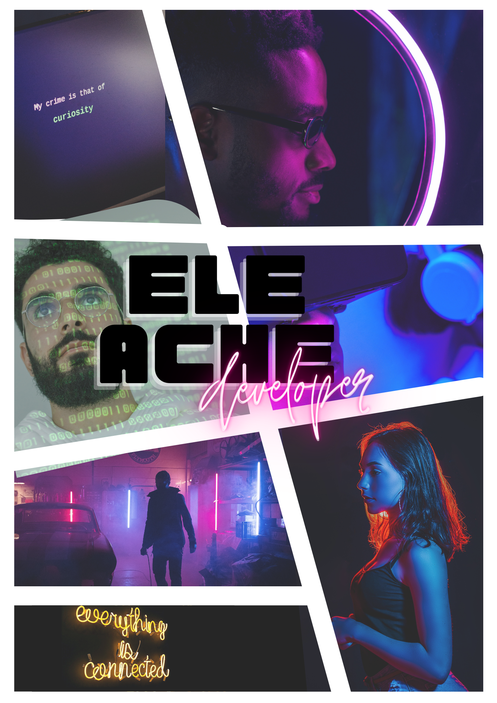

# eleAche de Avila

## fullstack dev

---
## EVERYTHING IS CONNECTED...
.png)

## Beta version of my tool "Cuervo" (shell scripting)
Termux, Debian Linux, Ubuntu Linux, Finnix Linux

## Ruby tools

